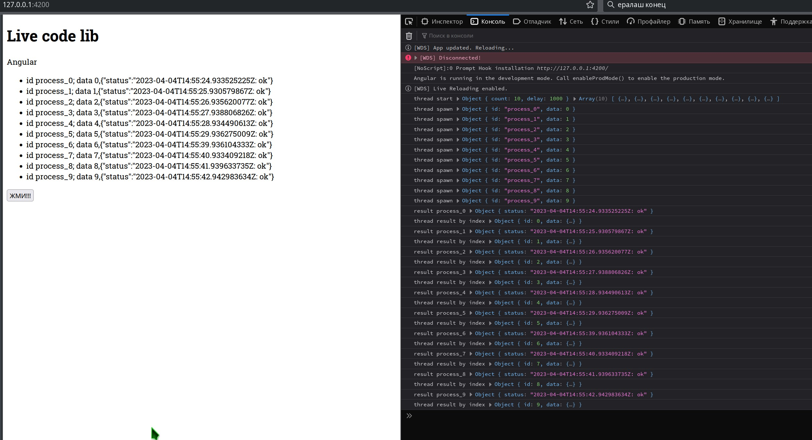
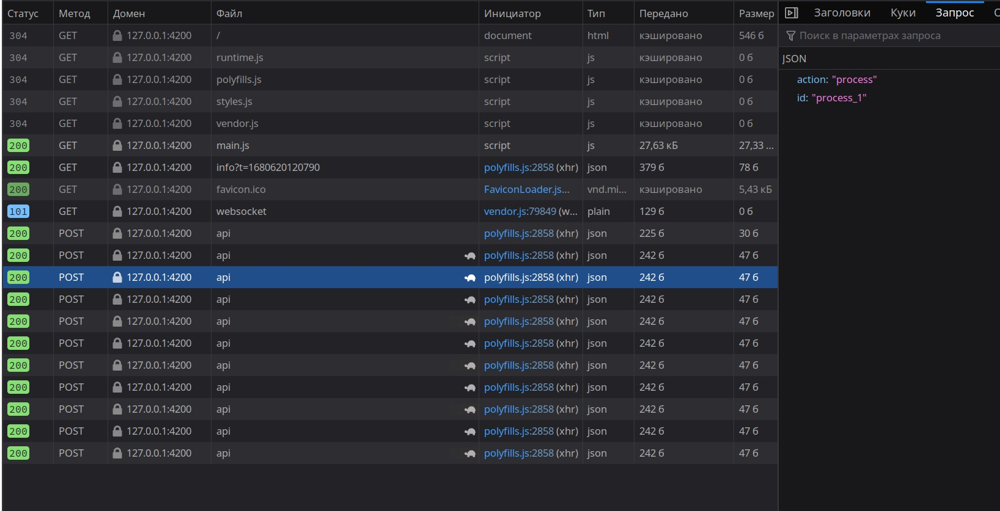

# angular-noup3n

## ТЗ

Сделать, форму на Angular, так, чтобы

при открытии из формы отправлялся POST запрос {'action': 'params'}, который вернет JSON, содержащий данные о количестве запросов (count) и задержек (delay) между ними

по нажатии на кнопку Отправить нужно чтобы отправлялось необходимое количество (count) параллельных POST запросов с указанной задержкой (delay) между ними. Формат запроса {'action': 'process'}

вывести в список в этой форме время отправки запроса на бэк и ответы от backend - каждый запрос-ответ, отдельная строка. Нужно учесть, что порядок ответов может не совпадать с порядком запросов

## Как запустить

 * фронт
	* поставить ноду через [nvm](https://github.com/nvm-sh/nvm), версия 10+
	* втянуть зависимости `npm i`
	* запустить сервер разработки `npm run start`
	* открыть в браузере `http://localhost:4200/`
	* открыть консоль браузера `f12` или `ctrl+shift+i`
 * Тыл
	* Вариант 1: `npm run start-be`
	* Вариант 2:
		```bash
			java -jar ServerTest.jar <parameters>

			# parameters:
			# -h help
			# -p port
			# -c count
			# -d delay ms
			# -t timeout ms
			# Например:

			java -jar ServerTest.jar -p 8081 -c 10 -d 1000
		```
 * `curl -X 'POST' -v 'http://localhost:8081/' --data '{'action':'params'}' -H 'Content-Type:application/json'`

## как пользоваться

 * Результат работы с выводом консоли
 * 
 * В сетевых запросах видна отладочная инфа
 * 